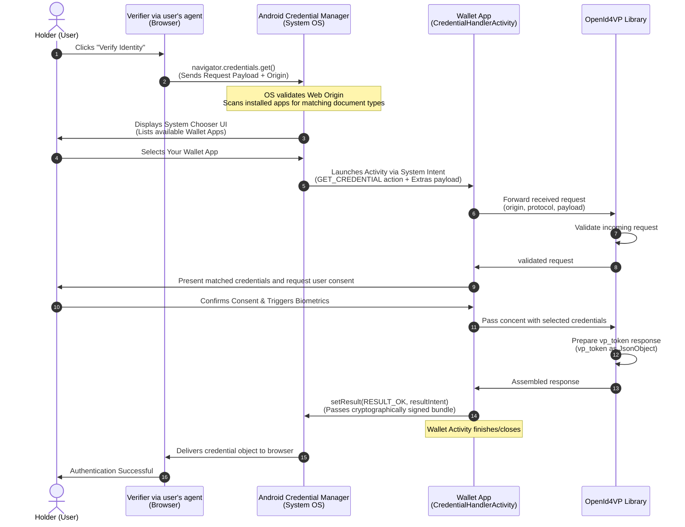

# EUDI OpenId4VP library

:heavy_exclamation_mark: **Important!** Before you proceed, please read
the [EUDI Wallet Reference Implementation project description](https://github.com/eu-digital-identity-wallet/.github/blob/main/profile/reference-implementation.md)

[](https://www.apache.org/licenses/LICENSE-2.0)

## Table of contents

* [Overview](#overview)
* [Disclaimer](#disclaimer)
* [How to use](#how-to-use)
    * [Openid4VP via http](#openid4vp-via-http-redirects)
      * [Resolve an authorization request URI](#resolve-an-authorization-request-uri)
      * [Holder's consensus, Handling of a valid authorization request](#holders-consensus-handling-of-a-valid-authorization-request)
      * [Dispatch authorization response to verifier / RP](#dispatch-authorization-response-to-verifier--rp)
      * [Dispatch authorization error response to verifier / RP](#dispatch-authorization-error-response-to-verifier--rp)
    * [Openid4VP via DC-API](#openid4vp-via-dc-api)
      * [Resolve an authorization request](#resolve-an-authorization-request)
      * [Assemble an authorization response](#assemble-an-authorization-response)
    * [WRP authorization using WRP Registration Certificate](#wrp-authorization-using-wrp-registration-certificate)
    * [Example](#example)
* [OpenId4VP features supported](#openid4vp-features-supported)
* [How to contribute](#how-to-contribute)
* [License](#license)

## Overview

This is a Kotlin library, targeting JVM, that supports the [OpenId4VP](https://openid.net/specs/openid-4-verifiable-presentations-1_0.html) protocol.
In particular, the library focuses on the wallet's role using this protocol, and provides the following features:

| Feature                                                                                                                   | Coverage                                                                                                                               |
|---------------------------------------------------------------------------------------------------------------------------|----------------------------------------------------------------------------------------------------------------------------------------|
| [Verifiable Presentations Authorization Requests](#resolve-an-authorization-request-uri)                                  | ✅                                                                                                                                      |
| Client authentication prefixes                                                                                            | ✅ pre-registered, ✅ redirect_uri, ❌ openid_federation, ✅ decentralized_identifier, ✅ verifier_attestation, ✅ x509_san_dns, ✅ x509_hash |
| Attestation query dialect                                                                                                 | ✅ DCQL                                                                                                                                 |
| Signed/encrypted authorization requests (JAR)                                                                             | ✅                                                                                                                                      |
| Scoped authorization requests                                                                                             | ✅                                                                                                                                      |
| Request URI Methods                                                                                                       | ✅ GET, ✅ POST                                                                                                                          |
| Wallet metadata                                                                                                           | ✅                                                                                                                                      |
| [Dispatch positive and negative responses](#dispatch-authorization-response-to-verifier--rp)                              | ✅                                                                                                                                      |
| [Dispatch authorization error response to verifier when possible](#dispatch-authorization-error-response-to-verifier--rp) | ✅                                                                                                                                      |
| Encrypted authorization responses                                                                                         | ✅                                                                                                                                      |
| Response modes                                                                                                            | ✅ direct_post, ✅ direct_post.jwt, ✅ query, ✅ query.jwt, ✅ fragment, ✅ fragment.jwt, ✅ dc_api, ✅ dc_api.jwt                             |
| Transaction Data                                                                                                          | ✅                                                                                                                                      |
| Verifier Attestation JWT                                                                                                  | ✅                                                                                                                                      |
| Digital Credential API                                                                                                    | ✅                                                                                                                                      |
| [Apply WRP Registration Policy](#wrp-registration-certificate-policy-)                                                                                       | ✅                                                                                                                                      |

## Disclaimer

The released software is an initial development release version: 
-  The initial development release is an early endeavor reflecting the efforts of a short time-boxed period, and by no means can be considered as the final product.  
-  The initial development release may be changed substantially over time, might introduce new features but also may change or remove existing ones, potentially breaking compatibility with your existing code.
-  The initial development release is limited in functional scope.
-  The initial development release may contain errors or design flaws and other problems that could cause system or other failures and data loss.
-  The initial development release has reduced security, privacy, availability, and reliability standards relative to future releases. This could make the software slower, less reliable, or more vulnerable to attacks than mature software.
-  The initial development release is not yet comprehensively documented. 
-  Users of the software must perform sufficient engineering and additional testing to properly evaluate their application and determine whether any of the open-sourced components is suitable for use in that application.
-  We strongly recommend not putting this version of the software into production use.
-  Only the latest version of the software will be supported

## How to use

> [!IMPORTANT]
>
> If you require support for [SIOPv2](https://openid.net/specs/openid-connect-self-issued-v2-1_0.html), use library versions till _**v0.11.x**_ which are published
> with the following Maven coordinates:
>
> * Group Id: eu.europa.ec.eudi
> * Artifact Id: eudi-lib-jvm-siop-openid4vp-kt
>
> Starting with version _**v0.12.0**_ support for [SIOPv2](https://openid.net/specs/openid-connect-self-issued-v2-1_0.html) has been dropped, and
> the library is published with the following Maven coordinates:
>
> * Group Id: eu.europa.ec.eudi
> * Artifact Id: eudi-lib-jvm-openid4vp-kt

```kotlin
// Include library in dependencies in build.gradle.kts
dependencies {
    implementation("eu.europa.ec.eudi:eudi-lib-jvm-openid4vp-kt:$version")
}
```

The library distinguishes 2 channels via which an authorization request can be received
- Via http (redirects) 
- Via [DC-API](https://openid.net/specs/openid-4-verifiable-presentations-1_0.html#appendix-A)

The entry point to the library is the interface [OpenId4Vp](src/main/kotlin/eu/europa/ec/eudi/openid4vp/OpenId4Vp.kt).
Currently, the library offers two implementations of this interface based on [Ktor](https://ktor.io/) Http Client.
Ktor is built from the ground up using Kotlin and Coroutines.

Depending on the channel via which the request is received, an instance of the interface can be obtained with the following code

```kotlin
import eu.europa.ec.eudi.openid4vp.*

val walletConfig: OpenId4VPConfig = OpenId4VPConfig(...)

val httpClient = HttpClient {
  install(ContentNegotiation) {
    json(json)
  }
  expectSuccess = true
}

// To handle requests coming through the http channel
val openId4VpOverRedirects = OpenId4Vp.overRedirects(walletConfig, httpClient)

// To handle requests coming through the DC-API channel
val openId4VpOverDcApi = OpenId4Vp.overDcApi(walletConfig, httpClient)
```

### Openid4VP via http (redirects)

#### Resolve an authorization request URI

Wallet receives an OAuth2.0 Authorization request, formed by the Verifier, that represents an
[OpenID4VP authorization request](https://openid.net/specs/openid-4-verifiable-presentations-1_0.html#name-authorization-request).

In the same device scenario, the aforementioned authorization request reaches the wallet in terms of a deep link.
Similarly, in the cross-device scenario, the request would be obtained via scanning a QR Code.

Regardless of the scenario, wallet must take the URI (of the deep link or the QR Code) that represents the
authorization request and ask the SDK to validate the URI (that is to make sure that it represents one of the supported
requests mentioned aforementioned) and in addition gather from Verifier additional information that may be included by
reference (such as `request_uri` etc.)

The interface that captures the aforementioned functionality is
[AuthorizationRequestOverHttpResolver](src/main/kotlin/eu/europa/ec/eudi/openid4vp/AuthorizationRequestResolver.kt)

```kotlin
import eu.europa.ec.eudi.openid4vp.*

val authorizationRequestUri : String // obtained via a deep link or scanning a QR code

val openId4VpOverRedirects = OpenId4Vp.overRedirects(walletConfig, httpClient)

val resolution = openId4VpOverRedirects.resolveRequestUri(authorizationRequestUri)
val requestObject = when (resolution) {
    is Resolution.Invalid -> throw resolution.error.asException()
    is Resolution.Success -> resolution.requestObject
}
```

#### Holder's consensus, handling of a valid authorization request

After receiving a valid authorization, the wallet has to process it. This means:

* wallet should check whether holder has claims that can fulfill verifier's requirements
* let the holder choose which claims will be presented to the verifier and form a `vp_token`

This functionality is a wallet concern, and it is not supported directly by the library

#### Dispatch authorization response to verifier / RP

After collecting holder's consensus, wallet can use the library to form an appropriate response and then dispatch it
to the verifier.
Depending on the `response_mode` that the verifier included in his authorization request, this is done via

* either a direct post (when `response_mode` is `direct_post` or `direct_post.jwt`), or
* by forming an appropriate `redirect_uri` (when response mode is `fragment`, `fragment.jwt`, `query` or `query.jwt`)

The library tackles this dispatching via [DispatcherOverHttp](src/main/kotlin/eu/europa/ec/eudi/openid4vp/ResponseDispatching.kt)

Please note that in case of `response_mode` `direct_post` or `direct_post.jwt` the library actually performs the
actual HTTP call against the verifier's receiving end-point.
On the other hand, in case of a `response_mode` which is neither `direct_post` nor `direct_post.jwt` the library
just forms an appropriate redirect URI.
It is the caller's responsibility to redirect the user to this URI.

```kotlin
val openId4VpOverRedirects = OpenId4Vp.overRedirects(walletConfig, httpClient)

val requestObject // calculated in previous step
val verifiablePresentations: VerifiablePresentations // provided by wallet
val consensus =  Consensus.PositiveConsensus(verifiablePresentations)

val dispatchOutcome = openId4VpOverRedirects.dispatch(requestObject, consensus)
```

#### Dispatch authorization error response to verifier / RP

If an error occurs during the resolution of an authorization request URI, either due to the authorization request
missing required data or being malformed, a Resolution.Invalid is returned. Depending on the type of the
AuthorizationRequestError that occurred, the library might be able to send an authorization error response to the verifier / RP.

Additionally, wallet can configure a policy regarding error dispatching to unauthenticated clients. Wallet can configure
via [OpenId4VPConfig.errorDispatchPolicy](src/main/kotlin/eu/europa/ec/eudi/openid4vp/Config.kt) whether to allow
dispatching of authorization error response to unauthenticated clients, or allow dispatching of authorization error 
responses only to authenticated clients.

A Resolution.Invalid that contains an AuthorizationRequestError that can be communicated to the verifier / RP via an
authorization error response also contains ErrorDispatchDetails.

Depending on the `response_mode` that the verifier included in his authorization request, error dispatching is done:

* via a direct post (when `response_mode` is `direct_post` or `direct_post.jwt`)
* by forming an appropriate `redirect_uri` (when response mode is `fragment`, `fragment.jwt`, `query` or `query.jwt`)

The library tackles error dispatching via [ErrorDispatcher](src/main/kotlin/eu/europa/ec/eudi/openid4vp/ErrorDispatcher.kt)

Please note that in case of `response_mode` `direct_post` or `direct_post.jwt` the library performs the actual HTTP 
call against the verifier's receiving end-point.
On the other hand, in case of a `response_mode` which is neither `direct_post` nor `direct_post.jwt` the library
just forms an appropriate redirect URI.
It is the caller's responsibility to redirect the user to this URI.

```kotlin
import eu.europa.ec.eudi.openid4vp.*

val openId4VpOverRedirects = OpenId4Vp.overRedirects(walletConfig, httpClient)

val authorizationRequestUri : String // obtained via a deep link or scanning a QR code

val resolution = openId4VpOverRedirects.resolveRequestUri(authorizationRequestUri)
if (resolution is Resolution.Invalid) {
  val (error, errorDispatchDetails) = resolution.error
  errorDispatchDetails?.let {
    val encryptionParameters: EncryptionParameters = TODO()
    val dispatchOutcome = openId4VpOverRedirects.dispatchError(error, it, encryptionParameters)
    when (dispatchOutcome) {
      is DispatchOutcome.RedirectURI -> TODO("Caller must redirect the user to '${dispatchOutcome.value}'")
      is DispatchOutcome.VerifierResponse.Accepted -> TODO("Verifier/RP successfully received authorization error response. Caller must redirect user to '${dispatchOutcome.redirectURI}'")
      DispatchOutcome.VerifierResponse.Rejected -> TODO("Verifier/RP did not receive or rejected the authorization error response.")
    }
  }
}
```

### Openid4VP via DC-API

The diagram below illustrates the interaction of a `Verifier` and a `Wallet` via Verifier's trusted end-point (trusted origin) to perform an OpenId4VP Authorization via DC-API.
User's agent might also be a mobile app installed in user's device. 
In both cases the operating system guarantees that the origin of the request (web domain or app package name) cannot be spoofed.

Given that the `Verifier` has prepared the appropriate request, and displayed to `Holder` through holder device's agent (browser) the flow below how the android OS (implements DC-API)
the EUDI Wallet interact. Also describes the responsibilities of the current library in the process.  




#### Resolve an authorization request

Wallet receives an OAuth2.0 Authorization request, formed by the Verifier, that represents an
OpenID4VP authorization request, specifically for the case of [DC-API](https://openid.net/specs/openid-4-verifiable-presentations-1_0.html#name-request).

The resolution the authorization request follows the same principled as with the case of requests received via the http channel (redirects).
1. Wallet should extract from system intent: (a) the protocol, (b) caller's origin and (c) request payload
2. Use OpenId4Vp.resolveRequestObject passing the above parameters
3. The result will be either a `Resolution.Success` containing the validated request object or a `Resolution.Invalid` containing the error that occured during the validation. 

The interface that captures the aforementioned functionality is
[AuthorizationRequestOverDCApiResolver](src/main/kotlin/eu/europa/ec/eudi/openid4vp/AuthorizationRequestResolver.kt)

```kotlin
import eu.europa.ec.eudi.openid4vp.*

val protocol: String // extracted from the request as it was passed to wallet from the system intent
val origin: String // extracted from the request as it was passed to wallet from the system intent
val requestData: JsonObject // extracted from the request as it was passed to wallet from the system intent

val openId4VpOverDcApi = OpenId4Vp.overDcApi(walletConfig, httpClient)

val resolution = openId4VpOverDcApi.resolveRequestObject(protocol, origin, requestData)
val requestObject = when (resolution) {
    is Resolution.Invalid -> throw resolution.error.asException()
    is Resolution.Success -> resolution.requestObject
}
```

#### Holder's consensus, handling of a valid authorization request

After receiving a valid authorization, the wallet has to process it. This means:

* wallet should check whether holder has claims that can fulfill verifier's requirements
* let the holder choose which claims will be presented to the verifier and form a `vp_token`

This functionality is a wallet concern, and it is not supported directly by the library

#### Assemble an authorization response

After collecting holder's consensus, wallet can use the library to form an appropriate response and then pass it to the verifier.

In the case of requests coming through the DC-API channel, the library does not perform the actual dispatching of the response to the verifier
(as in the case of the http channel).
Instead, it merely assembles the response and passes it to the caller that is responsible for passing the response to the verifier via 
an active DC-API channel. 

```kotlin
val openId4VpOverDcApi = OpenId4Vp.overDcApi(walletConfig, httpClient)

val requestObject // calculated in previous step
val verifiablePresentations: VerifiablePresentations // provided by wallet
val consensus =  Consensus.PositiveConsensus(verifiablePresentations)

val response: JsonObject = openId4VpOverDcApi.assembleResponse(requestObject, consensus)
```

### WRP authorization using WRP Registration Certificate

Library allows the caller to enforce Relying Party Authorization policies based on WRPRC. It can be configured to expect a Registration Certificate (WRPRC) 
to be provided in the authorization request. By doing so it is expected that the `ResolvedRequestObject.verifierInfo` array includes a WRPRC
as defined in 472-2 V1.2.1 and CIR 2026/1731 Annex II. 

> [!NOTE]
> The authorization policy can be applied for authorization requests coming both via DC API channel or http redirects.

> [!WARNING]
> 
> Authorization policy based on WRPRC is only applicable to `x509_hash` client id scheme.

> [!IMPORTANT]
> It is **not in the scope** of the library to provide implementations of authorization policies. Only gives the proper means to 
> hook a policy's application to the proper point of the authorization request resolution flow. 

To configure library to expect a registration certificate a [RegistrationCertificatePolicy](src/main/kotlin/eu/europa/ec/eudi/openid4vp/Config.kt) must be provided in `OpenId4VPConfig`. If such 
a policy is provided, and during the request object resolution step, the library will:
- Extract the registration certificate from the authorization request.
- Evaluate that the provided registration is signed by a trusted WPRRC Provider (calling `OpenId4VPConfig.registrationCertificatePolicy.trust()`)
- Evaluate that the provided registration certificate complies with the policy provided (calling `OpenId4VPConfig.registrationCertificatePolicy.apply()`)
- Include policy violation warnings, if any, in the final `Resolution.Success`  
- Fail the authorization request resolution step if policy is violated

```kotlin
val policy = RegistrationCertificatePolicy(
    trust = { chain: List<X509Certificate> -> ... },
    apply = { accessCertificate: X509Certificate, regCertContent: JsonObject, query: DCQL -> ... }, 
)

val openId4VPConfig = OpenId4VPConfig(
    ....
    registrationCertificatePolicy = policy, 
    ....    
)
```


### Example

Project contains an [example](src/test/kotlin/eu/europa/ec/eudi/openid4vp/Example.kt) which
demonstrates the functionality of the library and in particular the interaction of a
`Verifier` and a `Wallet` via Verifier's trusted end-point to perform an OpenId4VP Authorization via http.

To run the example, you will need to clone [Verifier's trusted end-point](https://github.com/eu-digital-identity-wallet/eudi-srv-web-verifier-endpoint-23220-4-kt)
and run it using

```bash
./gradlew bootRun
```
and then run the Example.


## OpenId4VP features supported

### Parameter `response_mode`

A Wallet can take the form of a web or mobile application.
OpenId4VP describes flows for both cases. Given that we are focusing on a mobile wallet we could
assume that `AuthorizationRequest` contains always a `response_mode`

Library currently supports `response_mode`
* `direct_post`
* `direct_post.jwt`
* `fragment`
* `fragment.jwt`
* `query`
* `query.jwt`
* `dc_api`
* `dc_api.jwt`


### Supported Client ID Prefixes

Library requires the presence of a `client_id` using one of the following prefixes:

- `pre-registered` assuming out of bound knowledge of verifier meta-data. A verifier may send an authorization request signed (JAR) or plain
- `redirect_uri` where verifier must send the authorization request in plain (JAR cannot be used)
- `decentralized_identifier` where verifier must send the authorization request signed (JAR) using a key resolvable via DID URL.
- `verifier_attestation` where verifier must send the authorization request signed (JAR), witch contains a verifier attestation JWT from a trusted issuer
- `x509_san_dns` where verifier must send the authorization request signed (JAR) using by a suitable X509 certificate
- `x509_hash` where verifier must send the authorization request signed (JAR) using by a suitable X509 certificate

> [!NOTE]
> The Client ID Prefix is encoded as a prefix in `client_id`. Absence of such a prefix, indicates the usage of the `pre-registered` Client ID Prefix.

### Retrieving Authorization Request (http channel case)

According to OpenID4VP, when the `request_uri` parameter is included in the authorization request wallet must fetch the Authorization Request by following this URI.
In this case there are two methods to get the request, controlled by the `request_uri_method` communicated by the verifier:
- Via an HTTP GET: In this case the Wallet MUST send the request to retrieve the Request Object using the HTTP GET method, as defined in [RFC9101](https://www.rfc-editor.org/rfc/rfc9101.html).
- Via an HTTP POST: In this case a supporting Wallet MUST send the request using the HTTP POST method as detailed in [Section 5.10](https://openid.net/specs/openid-4-verifiable-presentations-1_0.html#name-request-uri-method-post).

In the later case, based on the configured [SupportedRequestUriMethods](src/main/kotlin/eu/europa/ec/eudi/openid4vp/Config.kt), Wallet can communicate to the Verifier:
- A Nonce value to be included in the JWT-Secured Authorization Request (via `wallet_nonce` parameter)
- Its [metadata](src/main/kotlin/eu/europa/ec/eudi/openid4vp/internal/request/WalletMetaData.kt)  (via `wallet_metadata` parameter)

Library supports both methods.

### Authorization Request encoding (http channel case)

OAUTH2 foresees that `AuthorizationRequest` is encoded as an HTTP GET request which contains specific HTTP parameters.

OpenID4VP on the other hand, foresees in addition, support to
[RFC 9101](https://www.rfc-editor.org/rfc/rfc9101.html#request_object) where
the aforementioned HTTP Get contains a JWT encoded `AuthorizationRequest`

Library supports obtaining the request object both by value (using `request` attribute) or
by reference (using `request_uri`)

### Verifiable Credentials Requirements

As per OpenId4VP, the Verifier can describe the requirements of the Verifiable Credential(s) to be presented using [Digital Credentials Query Language (DCQL)](https://openid.net/specs/openid-4-verifiable-presentations-1_0.html#name-digital-credentials-query-l):

The Verifier articulated requirements of the Verifiable Credential(s) that are requested, are provided using
the `dcql_query` parameter that contains a [DCQL Query](https://openid.net/specs/openid-4-verifiable-presentations-1_0.html#section-6-2) JSON object.

According to OpenId4VP, verifier may pass the `dcql_query` either

* [by value](https://openid.net/specs/openid-4-verifiable-presentations-1_0.html#section-5.1-2.2.1)
* [using scope](https://openid.net/specs/openid-4-verifiable-presentations-1_0.html#name-using-scope-parameter-to-re)

Library supports all these options

> [!NOTE]
> Passing a DCQL Query by reference is not supported by OpenId4VP.

### Client metadata in Authorization Request

According to [OpenId4VP](https://openid.net/specs/openid-4-verifiable-presentations-1_0.html#section-5.1-2.4.1) verifier may pass his metadata (client metadata) by value. 
Library parses and validates the verifier metadata. 

### Supported response types

Library currently supports `response_type` equal to `vp_token`

## How to contribute

We welcome contributions to this project. To ensure that the process is smooth for everyone
involved, follow the guidelines found in [CONTRIBUTING.md](CONTRIBUTING.md).

## License

### Third-party component licenses

* OAUTH2 & OIDC Support: [Nimbus OAuth 2.0 SDK with OpenID Connect extensions](https://connect2id.com/products/nimbus-oauth-openid-connect-sdk)
* URI parsing: [Uri KMP](https://github.com/eygraber/uri-kmp)
* Http Client: [Ktor](https://ktor.io/)
* Json : [Kotlinx Serialization](https://github.com/Kotlin/kotlinx.serialization)

### License details

Copyright (c) 2023-2026 European Commission

Licensed under the Apache License, Version 2.0 (the "License");
you may not use this file except in compliance with the License.
You may obtain a copy of the License at

    http://www.apache.org/licenses/LICENSE-2.0

Unless required by applicable law or agreed to in writing, software
distributed under the License is distributed on an "AS IS" BASIS,
WITHOUT WARRANTIES OR CONDITIONS OF ANY KIND, either express or implied.
See the License for the specific language governing permissions and
limitations under the License.
